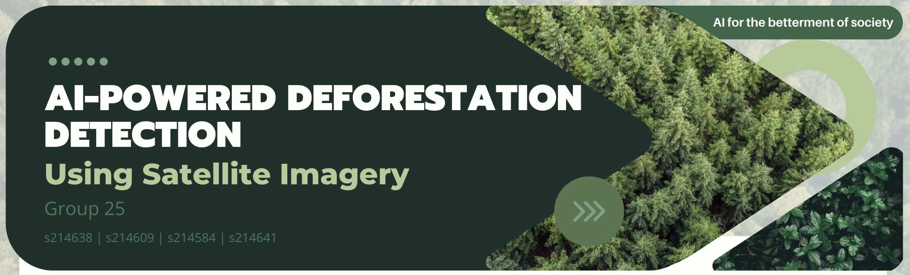

# AI for the Betterment of Society

<figure>
    <div style="text-align: center;">
        
    </div>
    <figcaption style="text-align: center; font-style: italic; font-size: smaller;">
        .
    </figcaption>
</figure>

This repository was developed as a part of the final project in Advanced Business Analytics course 42578 at DTU. We refer to the [**EXPLAINER NOTEBOOK**](https://github.com/KarolineKlan/advanced_ba_project/blob/main/notebooks/Explainer_Notebook.ipynb) for all details of the project.


Team members:

- Daniel Ries (s214641)
- Karoline Klan Hansen (s214638)
- Kristoffer Helms Kjær (s214609)
- Felix Lund Frandsen (s214584)


## Project structure

The project follows a cookiecutter directory structure, though not all components are utilized within the scope of this work:
```txt
├── .github/                  # Github actions and dependabot
│   ├── dependabot.yaml
│   └── workflows/
│       └── tests.yaml
├── configs/                  # Configuration files
├── data/                     # Data directory
│   ├── processed
│   └── raw
├── dockerfiles/              # Dockerfiles
│   ├── api.Dockerfile
│   └── train.Dockerfile
├── docs/                     # Documentation
│   ├── mkdocs.yml
│   └── source/
│       └── index.md
├── models/                   # Trained models
├── notebooks/                # Jupyter notebooks
├── reports/                  # Reports
│   └── figures/
├── src/                      # Source code
│   ├── project_name/
│   │   ├── __init__.py
│   │   ├── api.py
│   │   ├── data.py
│   │   ├── evaluate.py
│   │   ├── models.py
│   │   ├── train.py
│   │   └── visualize.py
└── tests/                    # Tests
│   ├── __init__.py
│   ├── test_api.py
│   ├── test_data.py
│   └── test_model.py
├── .gitignore
├── .pre-commit-config.yaml
├── LICENSE
├── pyproject.toml            # Python project file
├── README.md                 # Project README
├── requirements.txt          # Project requirements
├── requirements_dev.txt      # Development requirements
└── tasks.py                  # Project tasks
```


Created using [mlops_template](https://github.com/SkafteNicki/mlops_template),
a [cookiecutter template](https://github.com/cookiecutter/cookiecutter) for getting
started with Machine Learning Operations (MLOps).
